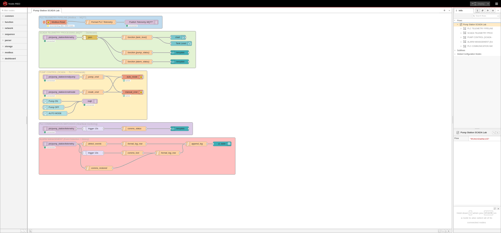
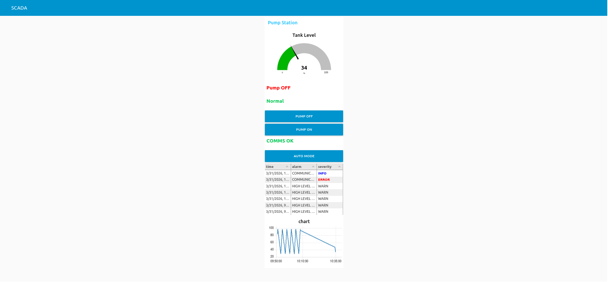

# Pump Station SCADA Lab


Industrial SCADA simulation using **PLC simulator, Modbus TCP, MQTT and Node-RED**.

This project simulates a **pump station automation system** with telemetry, alarms and remote control.

---

## Architecture


---

## Technologies

- Python (PLC simulator)
- Modbus TCP
- MQTT (Mosquitto)
- Node-RED
- SCADA Dashboard

---

## System Components

### PLC Simulator
Python application simulating a pump station PLC.

Telemetry generated:
- tank_level
- pump_status
- pump_cmd
- auto_mode
- alarm_high
- alarm_low
- heartbeat

---

### Gateway



Node-RED acts as a **gateway between Modbus and MQTT**.

Pipeline:
Modbus → JSON → MQTT telemetry


---

### SCADA Dashboard



Dashboard features:

- Tank level chart
- Pump status indicator
- Alarm status
- Pump control
- AUTO / MANUAL mode
- Alarm history table
- Communication monitoring

---

## Repository Structure

```
pump-station-scada-lab
│
├── docs
│ ├── architecture.png
│ ├── node-red-flow.png
│ └── dashboard.png
│
├── plc
│ └── plc_simulator.py
│
├── scada
│ └── node-red-flow.json
│
├── scripts
│
├── README.md
└── .gitignore
```

---

## Learning Goals

This lab demonstrates:

- industrial protocol integration
- SCADA architecture
- telemetry pipelines
- alarm detection
- event logging
- MQTT based industrial communication

---

## Future Improvements

Possible extensions:

- Docker deployment
- Grafana visualization
- InfluxDB telemetry storage
- Kubernetes deployment
- multiple PLC stations

